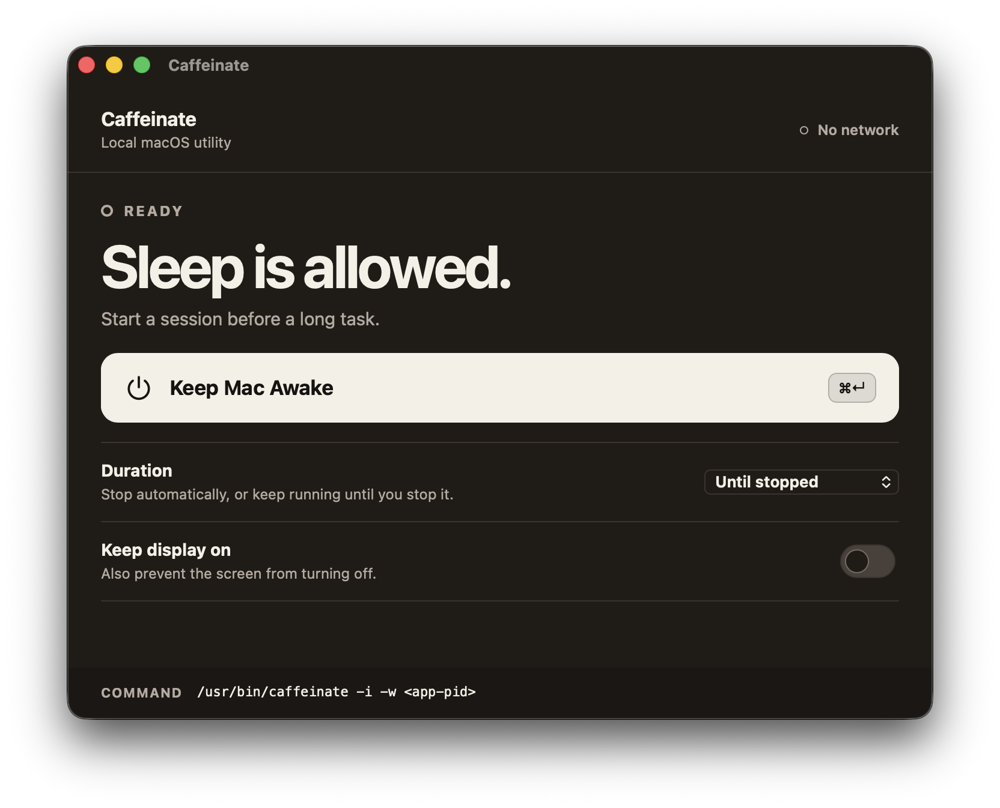
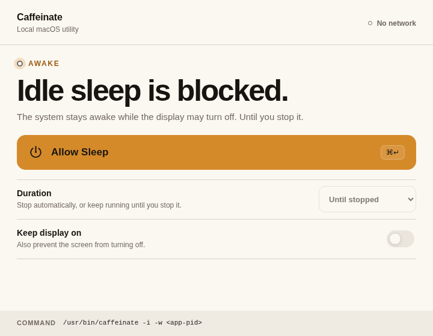

# Caffeinate for macOS

A focused Tauri desktop utility that keeps a Mac awake by owning the built-in `/usr/bin/caffeinate` process.

| Caffeinate ready state | Caffeinate active state |
| :---: | :---: |
|  |  |

## What it does

- Prevents idle system sleep with `caffeinate -i`.
- Optionally prevents display sleep with `-d`.
- Supports 30-minute, 1-hour, 2-hour, 4-hour, and until-stopped sessions.
- Uses `-w <app-pid>` so the assertion ends if the application terminates unexpectedly.
- Reconciles timed process exit and releases the assertion when the app closes.
- Runs locally with no account, telemetry, or network request.

This is a normal macOS application window. It does not continue running after the window is closed.

## Requirements

- macOS 12 or newer
- Xcode Command Line Tools
- Rust stable toolchain
- Bun 1.3.14 or newer compatible 1.x release

Install Apple build tools:

```bash
xcode-select --install
```

Install Rust using the official rustup installer, then verify:

```bash
rustc --version
cargo --version
```

Install Bun using the official Bun installer, then verify:

```bash
bun --version
```

## Development

```bash
bun install
bun tauri dev
```

The first `bun install` creates `bun.lock`. Commit that lockfile before publishing a release from your own environment.

## Tests and checks

```bash
bun test
cargo test --manifest-path src-tauri/Cargo.toml
bun run build
bun run verify:contract
```

Run all JavaScript-side checks:

```bash
bun run check
```

## Build the macOS application

Builds a universal binary (Intel + Apple Silicon) with an ad-hoc signature:

```bash
bun tauri build --bundles app,dmg --target universal-apple-darwin
```

To build for the host architecture only, drop `--target universal-apple-darwin`.

Expected outputs:

```text
src-tauri/target/universal-apple-darwin/release/bundle/macos/Caffeinate.app
src-tauri/target/universal-apple-darwin/release/bundle/dmg/Caffeinate_1.0.0_*.dmg
```

Signing is ad-hoc (`signingIdentity: "-"`): the app runs locally on any Mac but is not notarized. Add your Apple Developer identity and CI secrets before distributing outside your own Mac.

## Process model

The frontend never executes arbitrary shell text. Rust directly starts only this fixed binary:

```text
/usr/bin/caffeinate -i [-d] [-t seconds] -w <app-pid>
```

Rust owns the child handle, polls `try_wait`, kills it on Stop, and calls cleanup during Tauri's `RunEvent::Exit`.

## Project documents

- `PRODUCT.md` — product truth and scope
- `DESIGN.md` — Impeccable visual system
- `RALPH_LOOP.md` — bounded implementation and verification loop
- `RALPH_RUN_LOG.md` — executed evidence and environment limits
- `docs/superpowers/specs/` — design specification
- `docs/superpowers/plans/` — implementation plan

## License

MIT © [Aung Myo Kyaw](https://github.com/AungMyoKyaw)
