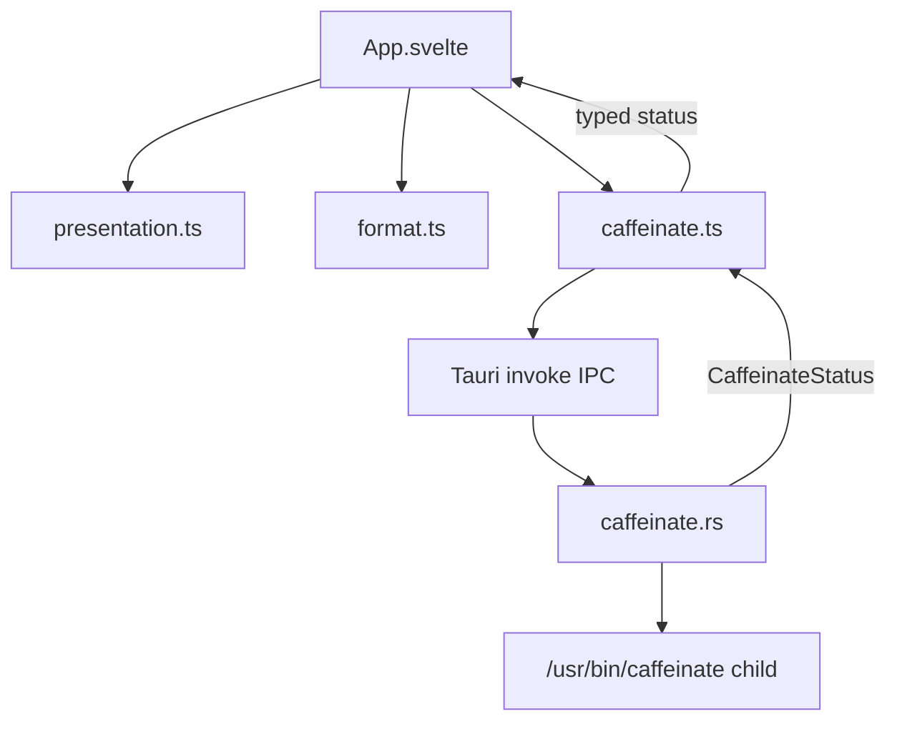
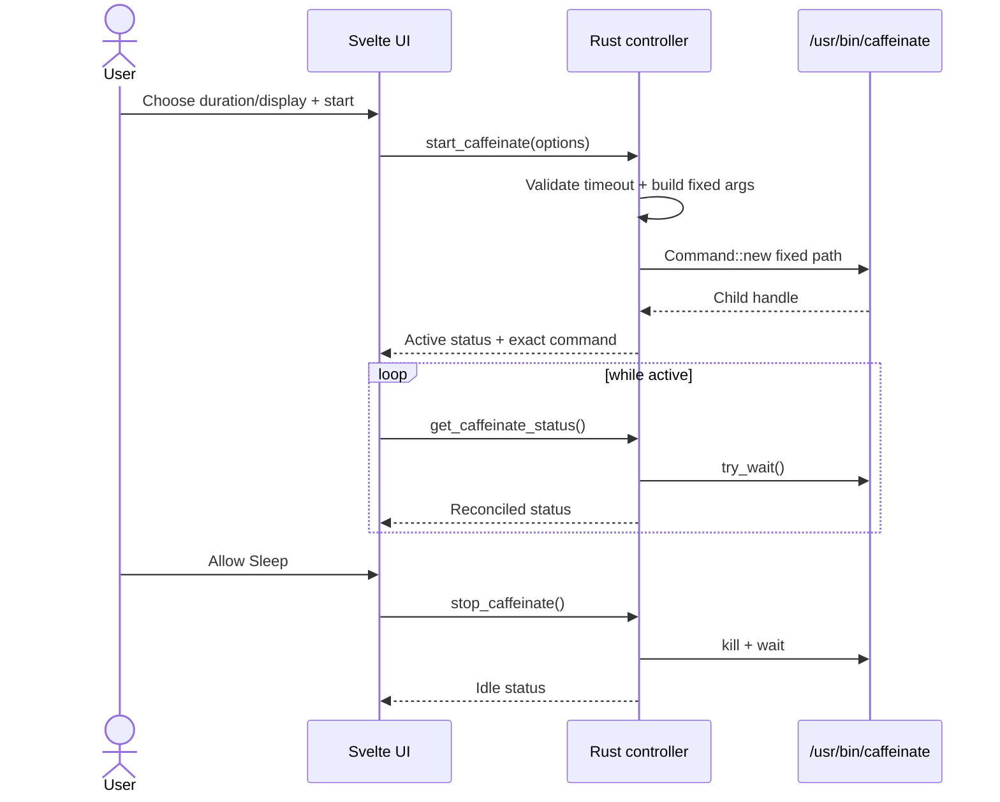

# Module and Data Flow

```mermaid
flowchart TB
  App[App.svelte]
  Present[presentation.ts]
  Format[format.ts]
  Client[caffeinate.ts]
  Invoke[Tauri invoke IPC]
  Controller[caffeinate.rs]
  Child["/usr/bin/caffeinate child"]

  App --> Present
  App --> Format
  App --> Client
  Client --> Invoke
  Invoke --> Controller
  Controller --> Child
  Controller -->|CaffeinateStatus| Client
  Client -->|typed status| App
```

## Primary sequence

```mermaid
sequenceDiagram
  actor U as User
  participant S as Svelte UI
  participant R as Rust controller
  participant C as /usr/bin/caffeinate

  U->>S: Choose duration/display + start
  S->>R: start_caffeinate(options)
  R->>R: Validate timeout + build fixed args
  R->>C: Command::new fixed path
  C-->>R: Child handle
  R-->>S: Active status + exact command
  loop while active
    S->>R: get_caffeinate_status()
    R->>C: try_wait()
    R-->>S: Reconciled status
  end
  U->>S: Allow Sleep
  S->>R: stop_caffeinate()
  R->>C: kill + wait
  R-->>S: Idle status
```
