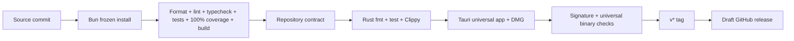

# Release Flow

```mermaid
flowchart LR
  Commit[Source commit] --> Install[Bun frozen install]
  Install --> Frontend[Format + lint + typecheck + tests + 100% coverage + build]
  Frontend --> Contract[Repository contract]
  Contract --> Rust[Rust fmt + test + Clippy]
  Rust --> Package[Tauri universal app + DMG]
  Package --> Inspect[Signature + universal binary checks]
  Inspect --> Tag[v* tag]
  Tag --> Draft[Draft GitHub release]
```

CI runs source quality gates on macOS. Release publishing is separate and has the only workflow permission that writes repository release content.
