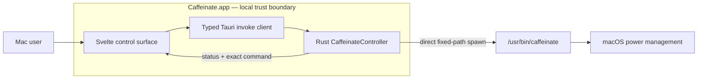

# System Context

```mermaid
flowchart LR
  User[Mac user]

  subgraph App["Caffeinate.app — local trust boundary"]
    UI[Svelte control surface]
    Bridge[Typed Tauri invoke client]
    Rust[Rust CaffeinateController]
  end

  OS["/usr/bin/caffeinate"]
  Mac[macOS power management]

  User --> UI
  UI --> Bridge
  Bridge --> Rust
  Rust -->|direct fixed-path spawn| OS
  OS --> Mac
  Rust -->|status + exact command| UI
```

There is no network service, account system, analytics endpoint, or arbitrary shell boundary.
